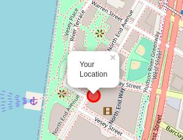
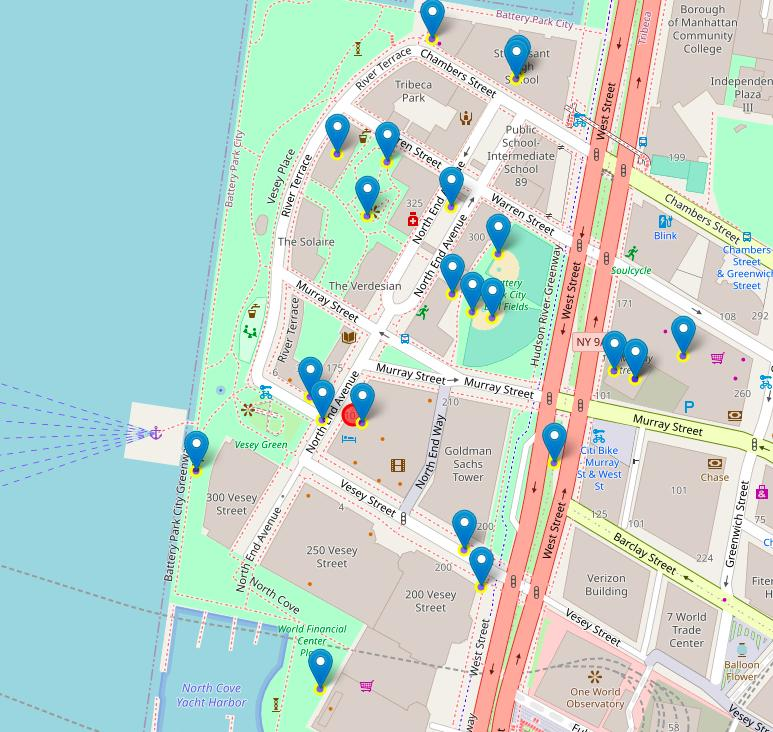

# FourSquare-API

FourSquare is a type of City giude website which provides information about the nearby places around your current location or the location you wan't to explaore.

Foursquare API are useful for developers to explore places using programs.
Foursquare provides a lots of API grouped into premium and regular calls. Some of the API that will be used in this project will be:
<ul>
    <li>Search Endpoints</li>
    <li>Explore Endpoints</li>
    <li>Trending Endpoints</li>
    <li>User Endpoints</li>
</ul>
All these endpoints are <code>Regular API Endpoints</code>

Some of the <code>Premium API Enpoints</code> are :
<ul>
    <li>Venues Photos</li>
    <li>Venues Tips</li>
    <li>Venues Menu</li>
</ul>

To make a call to the API you have to pass:
<code>CLIENT ID, CLIENT SECRET</code> and the <code>VERSION</code> of the API to be used.

## Visualization

### Before Query
  

### After Query

